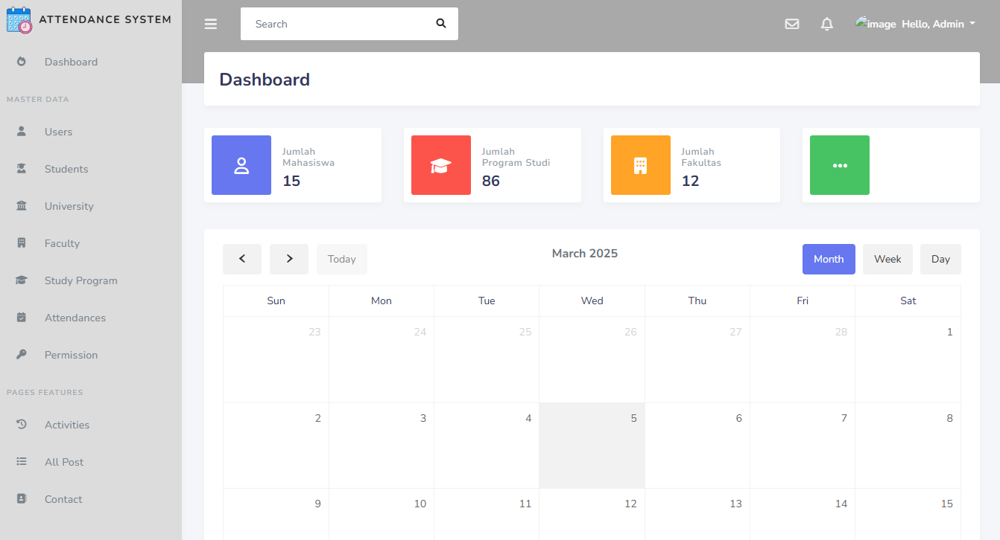

# Laravel Attendance App

Laravel Attendance app digunakan untuk Aplikasi Absensi Mahasiswa dari sisi backend untuk pembuatan RESTful API dan halaman Dashboard Admin dalam mengelola data mahasiswa

## Fitur Utama

-   🖥️ Admin Dashboard
-   🔒 Two Factor Authentication Admin Dashboard
-   🖼️ Changes Images Admin
-   🔑 Changes Password Admin
-   ❓ Forgot Password Admin
-   👥 Kelola Data Users
-   📅 Kelola Data Absensi
-   🎓 Kelola Data Program Studi
-   🏢 Kelola Data Fakultas
-   🛡️ Kelola Data Permission
-   🔐 API login dan logout
-   🔑 API permission
-   📅 API Absensi
-   🎓 API Data Universitas
-   🖼️ API Update Images Profile
-   📩 Send Notification Permission

# Admin Credentials

> Email: admin@example.com || Password: superadmin21

## Dashboard View

## Teknologi yang digunakan

